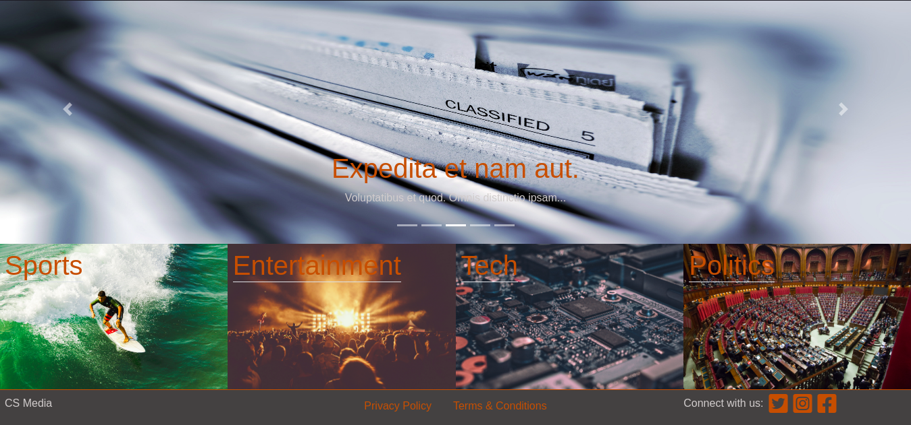
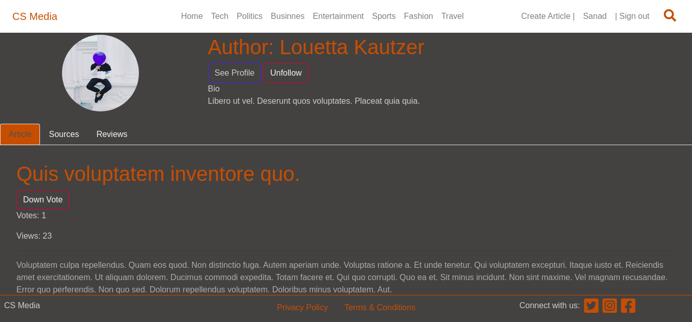
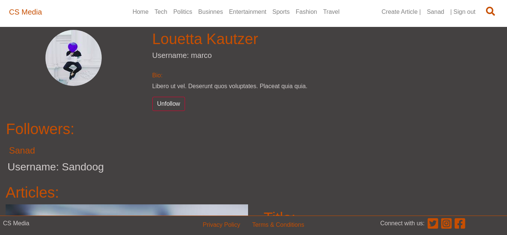

# Crowd Sourced Media Website


> Ruby's on Rails Crowd Sourced Media Website Project 

## Concept
>  The concept behind this project is to combat the slew of fake news nad general mistrust they have created in the publlic eye. To achieve this my app require any user to add atleast one source, though more can be added, to justify their articles content, this can be a video, audio or pdf. Further more users can create reviews for articles either verifying whats is stated or exposeing it as misinformation, all reviews can have attached files as well. Finally user may vote for articles with good verified content to promote a more secure article heirarchy. 
## Usage

- This project intends to practice my skills building a full working MVP;
- Prepare data architecture documentation;
- Working with deployment to Heroku.
- Working Amazon S3 services<br>

## Video Presentation

[Project Video Presentation](https://www.loom.com/share/8e31b4dad9964eaeab5b5325e7bb85e1)

## Live Demo

[Project live website](https://crowd-sourced-media.herokuapp.com/)


   
  
## 🛠 Getting Started

> To get a local copy up and running follow these simple example steps.

- Go to the main page of the repo.
- Copy this Code `https://github.com/jurgen1c/CS-Media.git`


### 📝 Setup

 - Open a terminal
 
 - Copy this code : 
        ```
        git clone https://github.com/jurgen1c/CS-Media.git
        ```
 - Copy this code to install the gems :
         ```
        bundle install
        ```
 - Copy this code to migrate th db :
 
        ```
        rails db:create && rails db:migrate && rails db:seed
               
        
- Visit `http://localhost:3000`

### 📝 What you will find:
  1. The user logs in to the app, Use: `sanad@sandoog.com` as email, and `123456` as password :)
   
   
    

  2. The user is presented with the homepage that includes:
       - Top menu with links and search.
       - *Popular Articles* carousel in the centre .
       - Categories with backgrounds.
       - Categories pills with articles ordered by most recent

    
    
  3. The *Article* section includes:
       - Nav tabs
       - First tab displays article content and comments + comment form
       - Second Article Sources
       - Third article reviews and new review form
       - Article author and info

    

  4. The user profile includes
       - User info
       - Followers
       - User Articles
   
### Automated Tests

- In root directory copy this into your terminal:
            ```
           bundle exec rspec
            ```
- All the test should pass   

### Build With

- Ruby 2.7.1
- Ruby on Rails 6.0.3

### Deployed On:
- Heroku
- Amazon S3         

## 👤 Authors


👤 **Jurgen Clausen Gutierrez**

- Github: [@jurgen1c](https://github.com/jurgen1c)
- LinkedIn: [jurgen-clausen](https://www.linkedin.com/in/jurgen-clausen-2740061a9/)


## 🤝 Contributing

Contributions, issues and feature requests are welcome!

Feel free to check the [issues page](issues/).

## Show your support

Give a ⭐️ if you like this project!

## Acknowledgments

- Hat tip to anyone whose code was used
- Microverse
- etc

## 📝 License

This project is [MIT](lic.url) licensed.
